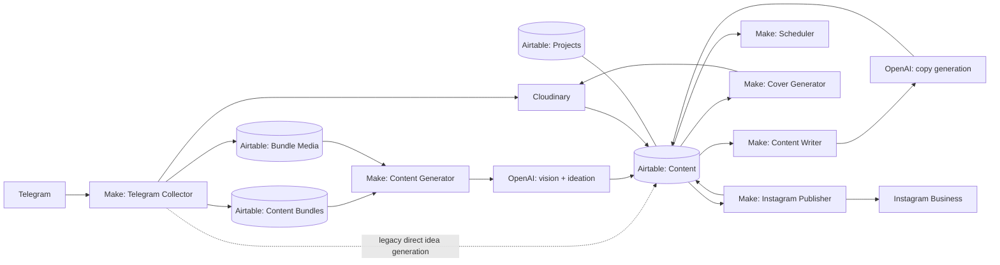
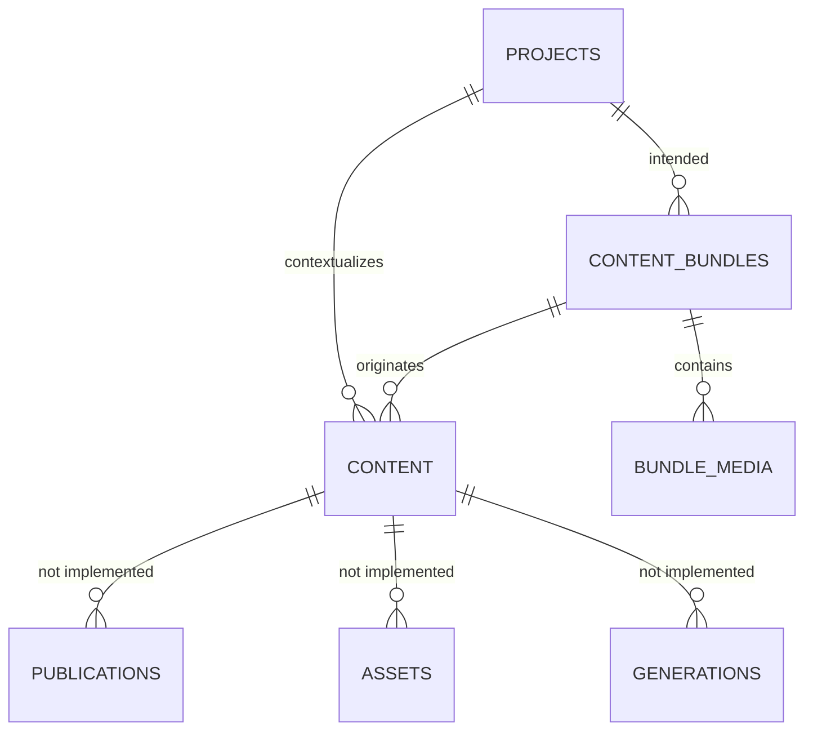

# Current Architecture

## Purpose and scope

This is the as-built architecture derived from the exported assets, not a proposed replacement. The documented target is a content operating system for converting founder/team input and project media into approved Instagram content.

## Logical architecture



## Source of truth and responsibilities

| Layer | Present responsibility | Current concern |
| --- | --- | --- |
| Telegram | Capture text, voice, document-photos, video, and the `finish` control word | No documented `/new`, `/ready`, `/status`, `/cancel`, `/help`, or approval buttons are implemented in the blueprint. |
| Make | Triggering, routing, storage, AI calls, scheduling, rendering orchestration, and publishing | One collector scenario has too many responsibilities and overlaps the dedicated generator. |
| Airtable | Operational database / human control surface | The four core tables are appropriate but field consistency and lifecycle control are insufficient. |
| Cloudinary | Persistent external URL for source and generated media | Security, asset lifecycle, foldering, and ownership are not modeled. |
| OpenAI | Transcription, image analysis, ideation, and writing | Calls lack schema enforcement, persistence of result metadata, and robust error handling. |
| Instagram Business | Feed photo and carousel posting | Posting is not a fully reconciled publication subsystem. |

## Current Airtable entity model



Four actual tables are exported:

- `Projects`: master project context, media, and existing content links.
- `Content Bundles`: an input-session record, with Telegram metadata, media summary, GPT state, and links to media/content.
- `Bundle Media`: one uploaded file per row, linked to a bundle.
- `Content`: idea, written copy, carousel data, schedule, and publication-related fields.

The line between `Content Bundles` and `Content` exists conceptually but is not reliably populated in the supplied exports. The current model also duplicates source media at the bundle level and on individual media rows.

## Scenario inventory

| Scenario export | Primary responsibility | Architecture status |
| --- | --- | --- |
| `Telegram Bot - Content collector.blueprint (8).json` | Ingests Telegram and performs both collection and direct ideation | Monolithic and overlapping; requires consolidation. |
| `Content Generator.blueprint (3).json` | Converts Ready photo-backed bundle to five ideas | Canonical direction, but not input-complete. |
| `Content Writer — Approved to Written.blueprint (4).json` | Generates publication copy | Useful but unvalidated. |
| `Scheduler- Written to Scheduled.blueprint (3).json` | Assigns content date/state | Partial queue policy. |
| `Cover Generator.blueprint (26).json` | Renders carousel cover/slides | Partial asset-production stage. |
| `Instagram Publisher.blueprint (7).json` | Posts feed and carousel content | Partial publisher. |
| `make_notes.txt.txt` | Empty | No operational documentation. |

## Required architecture decisions

1. **One ingestion contract.** Every Telegram update must either append to one active bundle or explicitly create a new one. It must never independently generate content in parallel with bundle processing.
2. **One canonical identifier.** Use Airtable record IDs for links and expose a human-readable immutable Bundle Code only for operations and support. Do not alternate joins between `Bundle ID`, `Bundle ID Auto`, and text copies.
3. **One state machine per entity.** Bundle state should describe input/generation lifecycle; Content state should describe editorial/publication lifecycle. GPT status should be a processing detail, not a competing lifecycle.
4. **One separate execution/job log.** AI, rendering, and publish operations need durable job records with attempt, provider, response reference, cost, retry time, and terminal error.
5. **One approval boundary.** Generated content cannot auto-publish. Approval/revision must be captured as an action with actor and timestamp.
6. **One asset model.** Store source asset, generated asset, rendition, order, intended channel, and provenance independently from rich text content.

## Target Phase 1 boundary

The knowledge base correctly prioritizes a small, observable production loop:

```text
New bundle -> validate input -> generate five ideas -> editor review -> approve one item
-> write content package -> calendar preview -> manual publishing confirmation
```

Video generation and expanded providers remain outside this boundary. The selected Reel MVP is documented separately as the intended next route: source media already held in Cloudinary is assembled through an isolated `Reel Production — Cloudinary Assembly` Make scenario, with OpenAI TTS and an Airtable approval boundary. See [`CLOUDINARY_REEL_ASSEMBLY.md`](CLOUDINARY_REEL_ASSEMBLY.md) and [`MAKE_REEL_PRODUCTION_CLOUDINARY_RUNBOOK.md`](MAKE_REEL_PRODUCTION_CLOUDINARY_RUNBOOK.md). It must pass its one-record acceptance test before it is enabled or connected to the Publisher.
