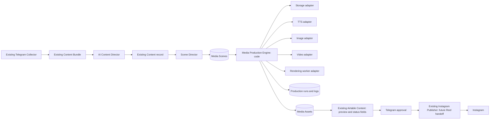

# Media Production Engine Architecture

## Purpose

The Media Production Engine is a new code-based production layer downstream of the existing Content Bundle and Content workflow. It creates editable, reviewable media outputs from an approved content brief. It does not replace the Telegram Collector, Content Bundles, core Airtable tables, carousel pipeline, or existing feed/carousel publishing logic.

The first implementation produces only Instagram Reels. Its foundation supports later media types and channels through explicit assets, scenes, runs, and provider adapters.

## System boundary



Make stays outside video-production mechanics. It orchestrates triggers, Airtable state updates, authenticated webhook calls, preview/approval notifications, and the approved publishing handoff.

## Engine modules

| Module | Responsibility | MVP requirement |
| --- | --- | --- |
| Production API | Receives validated commands from Make, creates/returns stable run IDs, exposes status | Yes |
| Production orchestrator | Expands approved scenes into jobs; coordinates dependencies and retries | Yes |
| Asset resolver | Resolves authorized Bundle Media and production assets into stable source references | Yes |
| TTS service | Requests narration through a provider adapter and registers audio | Yes |
| Audio processor | Normalizes narration, measures duration, creates mix-ready audio | Yes |
| Subtitle service | Turns final narration/voice-over segments into timed subtitles and burned-in captions | Yes |
| Scene renderer | Trims video, turns stills into motion, applies crop/fit and on-screen text | Yes |
| Timeline assembler | Places scenes, simple cuts, optional intro/outro, narration, subtitles, and audio into one render | Yes |
| Render validator | Validates file presence, aspect ratio, duration, audio, subtitle burn-in, and source traceability | Yes |
| Storage service | Stores/retrieves source and outputs through a provider adapter | Yes |
| Generation services | Requests/polls AI image/video assets through adapters | Interface only; not used in MVP |
| Publication service | Records a publication handoff/result | Interface only; existing Make publisher remains publisher |

## Engine data ownership

- Existing Airtable `Content Bundles`, `Bundle Media`, `Content`, and `Projects` remain the editorial/operational source of truth.
- New production records are additive: `Media Scenes`, `Media Assets`, and `Production Runs` (or equivalent engine persistence). They do not replace core tables.
- The engine owns technical job state, output provenance, retry history, worker jobs, checksums, and detailed logs.
- Airtable Content receives concise operator-facing summary fields: production status, approved preview/final asset reference, error summary, and approval metadata.

## Asset lifecycle

```text
Original source asset -> approved source asset -> scene/intermediate render
                                      \-> generated asset (future only)
Narration asset -> subtitle asset -> final publication asset
```

Every derivative keeps its parent asset ID, originating scene/run ID, and storage reference. A final publication asset is immutable once approved; any render change creates a new version and invalidates approval.

## First implementation pipeline

```text
Approved Reel brief
-> editable scene records
-> narration generation/normalization
-> subtitle timing
-> per-scene render from original video/images
-> simple timeline assembly
-> render validation
-> final preview asset
-> Telegram preview
-> manual approval
-> existing Publisher Reel handoff
```

The MVP does not use generated images/video, multi-track sound design, advanced transitions, or new channels.

## Design guarantees

1. All commands, scenes, assets, renders, and publication attempts have stable IDs.
2. Retries reuse an existing completed result whenever the request signature is unchanged.
3. Scene or final-render changes invalidate previous approval automatically.
4. The engine can render from original video, still images/renders, or a mixed sequence without a data-model rewrite.
5. Providers are accessed only behind replaceable adapters.
6. Make never executes FFmpeg-like media work, polls long-running provider jobs, or contains media transformation logic.
