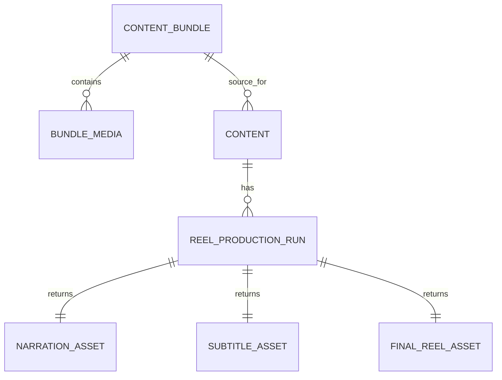

# Reel Data Model

## Approach

The Reel phase extends the existing `Content` record and reuses its linked `Content Bundle` and `Bundle Media` inputs. It does not replace existing carousel fields or tables. New Reel fields should be populated only for records whose `Post Type` is `Reel`.

## Required Content fields for Reels

| Field | Type | Purpose |
| --- | --- | --- |
| Reel Topic | Single-line text | Specific Reel subject selected from the complete Bundle. |
| Hook | Existing text field | Opening on-screen/editorial hook. |
| Reel Script | Existing long text field | Complete visual/editorial script. |
| Voice-over Script | Long text | Final narration sent to TTS; separate from the visual script. |
| Caption | Existing long text field | Instagram caption body. |
| CTA | Existing text field | Approved call to action. |
| Hashtags | Existing long text field | Approved hashtag string. |
| Reel Scene Plan | Long text containing validated JSON | Ordered scenes, source-media selection, timings, on-screen text, and transitions. |
| Narration Language | Single select | Language sent to TTS. |
| Voice Profile | Single select/text | Brand voice configuration key, not a provider-specific ID. |
| Narration | Attachment or URL | Generated narration audio asset. |
| Subtitle File | Attachment or URL | Generated timed subtitle file, e.g. SRT/VTT. |
| Final Reel | Attachment or URL | Final vertical MP4 preview/publication asset. |
| Reel Duration Seconds | Number | Rendered duration for validation and publishing. |
| Reel Production Status | Single select | See controlled values below. |
| Reel Production Request ID | Single-line text | Immutable idempotency key linking TTS and render work. |
| TTS Job ID | Single-line text | Provider-neutral external job reference. |
| Assembly Job ID | Single-line text | Render service external job reference. |
| Reel Production Error | Long text | Human-readable latest error; exclude secrets. |
| Reel Preview Sent At | Date/time | When Telegram preview was delivered. |
| Reel Approved At | Date/time | When manual approval occurred. |
| Reel Approved By | Text / collaborator | Manual approver. |
| Instagram Reel ID | Single-line text | Publishing receipt. |
| Instagram Reel Permalink | URL | Publishing receipt. |
| Reel Published At | Date/time | Publishing timestamp. |

## Controlled Reel Production Status values

```text
Not Requested
Brief Ready
Queued
Narration Generating
Narration Ready
Assembly Rendering
Preview Ready
Approval Required
Approved for Publishing
Production Failed
Published
```

`Production Failed` is a status for an actionable failed operation; it must be accompanied by `Reel Production Error` and retain the prior assets. `Published` must only be written after Instagram returns a successful Reel identifier.

## Existing fields that remain unchanged

- Content Bundle / source linkage
- Project, Topic, Title, Content Category, Content Pillar, Priority
- Post Type and existing Content Status
- Carousel Slides, Cover Image URL, Carousel Image URLs, Instagram Carousel URLs
- Feed/carousel scheduling and publication fields

Reel fields must not overwrite carousel fields, and the carousel generator must not read or write Reel fields.

## Minimal relationship model



For the first implementation, `REEL_PRODUCTION_RUN` may be represented by the requested job/request/error fields on Content rather than a new Airtable table. If retries, multiple revisions, or cost reconciliation become common, introduce a dedicated `Reel Production Runs` table; do not introduce it pre-emptively.

## Scene-plan JSON contract

Store a valid JSON array rather than free-form prose. Each entry needs only what assembly needs:

```json
[
  {
    "sequence": 1,
    "source_media_id": "Bundle Media Airtable record ID",
    "start_seconds": 0,
    "end_seconds": 3.5,
    "on_screen_text": "Hook text",
    "voice_over_segment": "Narration segment",
    "transition_after": "cut"
  }
]
```

The `source_media_id` must reference existing Bundle Media. A photo/render scene may use a still-duration field instead of in/out trim. Any intro/outro is represented explicitly, never silently added.

## Data integrity rules

1. One Reel Production Request ID corresponds to one Content record and one production attempt.
2. Do not submit TTS or assembly twice for the same request unless the prior status is `Production Failed` or a new revision/request ID is created.
3. Final Reel is required before `Preview Ready`; narration and subtitle file are required before `Assembly Rendering` completes.
4. Approval must record approver and timestamp; a regenerated Reel invalidates prior approval.
5. The existing Publisher must use only `Final Reel`, never an arbitrary Bundle Media video.
