# Reel Production Architecture

## Scope

This architecture adds an Instagram Reel production path to the existing Montanum Content OS. It preserves the working Telegram Collector, its single Content Bundle behaviour, the current carousel pipeline, the existing Content table, and the existing Instagram Publisher as the publishing entry point.

Only Instagram Reels are in scope. LinkedIn, YouTube, TikTok, and other channels are excluded.

## Target flow

```mermaid
flowchart LR
  TG[Telegram Collector] --> B[Existing Content Bundle]
  B --> G[Bundle-aware GPT generation]
  G --> C[Existing Content record: Post Type = Reel]
  C --> RP[Reel Production scenario]
  RP --> TTS[TTS provider adapter]
  RP --> ASM[Reel assembly service]
  TTS --> ASM
  ASM --> AT[Airtable: Reel fields + assets]
  AT --> PV[Telegram preview notification]
  PV --> AP[Manual approval]
  AP --> IP[Existing Instagram Publisher: Reel route]
  IP --> IG[Instagram Reels]
```



## Design principles

- **Bundle first:** the existing Collector remains responsible for accepting videos, photos, renders, text, and voice notes, and for putting all of them in one Content Bundle.
- **One Reel Content record:** GPT creates one or more existing Content records with `Post Type = Reel`; the Reel pipeline operates on one approved-for-production record at a time.
- **No carousel regression:** the Cover Generator, carousel fields, and existing feed/carousel publisher routes are not changed for Reel production.
- **Preview before publishing:** generation and assembly may be automatic; external publication must only occur after the user manually approves the completed preview.
- **Provider-neutral TTS:** Make calls an adapter contract, not a named TTS provider. The eventual provider can be replaced without changing Airtable fields, editorial logic, or assembly logic.
- **Original media as source:** video clips in Bundle Media are the primary source. Photos/renders can be inserted as held scenes only when the Reel plan asks for them.

## Component responsibilities

| Component | Responsibility | Not responsible for |
| --- | --- | --- |
| Existing Telegram Collector | Collects every input into the current Bundle | Reel editing, TTS, subtitles, approval, publishing |
| Existing Bundle/Content generation | Understands the complete Bundle and creates a Reel-oriented Content record | Creating final video files |
| Reel Brief Generator | Produces a validated Reel package: topic, hook, full Reel script, voice-over, caption, CTA, hashtags, scene plan | TTS, rendering, publication |
| Reel Production scenario | Orchestrates narration request, assembly request, statuses, and preview notification | Media composition engine internals |
| TTS provider adapter | Converts approved narration text into one audio asset | Editorial writing, video assembly, Instagram publishing |
| Reel assembly service | Combines selected source assets, narration, subtitles, transitions, intro/outro, and exports a vertical Reel | Choosing content angle or publishing |
| Airtable | Holds editorial source, asset references, status, approval, and production trace | Binary video processing |
| Existing Instagram Publisher | Publishes only manually approved, scheduled Reel assets | Producing or approving a Reel |

## Provider-neutral interfaces

### TTS request

The Reel Production scenario sends a provider-independent request:

```json
{
  "request_id": "stable-reel-production-id",
  "narration_text": "Approved voice-over script",
  "language": "en",
  "voice_profile": "default-brand-voice",
  "delivery_format": "mp3",
  "target_loudness": "platform-standard",
  "callback_reference": "Airtable Reel Content record"
}
```

The adapter returns `audio_url`, `provider_job_id`, `duration_seconds`, `status`, and a non-sensitive error payload when applicable. The actual provider, voice catalogue, authentication, and retry implementation are isolated inside the adapter.

### Assembly request

The Reel Production scenario sends an explicit, deterministic assembly request:

```json
{
  "request_id": "stable-reel-production-id",
  "format": { "width": 1080, "height": 1920, "aspect_ratio": "9:16" },
  "source_assets": ["ordered Bundle Media URLs"],
  "scene_plan": ["validated ordered scene instructions"],
  "narration_url": "TTS output URL",
  "subtitle_style": "Montanum default",
  "intro": { "enabled": false },
  "outro": { "enabled": false },
  "transitions": { "enabled": false, "style": "cut" },
  "output_format": "mp4"
}
```

It returns `final_reel_url`, `subtitle_url`, duration, render job ID, status, and error data. These contracts allow a future hosted video API, worker, or local rendering service without redesigning the Airtable/Make workflow.

## Reel lifecycle

```text
Idea / Draft
  -> Reel Brief Ready
  -> Reel Production Queued
  -> Narration Generating
  -> Assembly Rendering
  -> Preview Ready
  -> Manual Approval Required
  -> Approved for Publishing
  -> Scheduled
  -> Published

Any production step -> Production Failed -> retry or manual correction
Manual revision -> Draft / Reel Brief Ready
```

`Preview Ready` is never publishable. Only `Approved for Publishing` can enter the existing Publisher's future Reel route.

## Asset policy

- Bundle Media remains the source for original video, photos, and renders.
- The Reel Content record holds the approved narration, subtitle file, final Reel, and production status requested for this phase.
- Generated audio, subtitle, and final video must retain their originating Content record and production request ID.
- Original source ordering is respected; the scene plan determines editorial selection. No asset is silently substituted.

## Boundaries for this phase

The first Reel version supports: vertical output, one narration track, burned-in subtitles, original source media, optional simple cuts/transitions, optional brand intro/outro, Telegram preview, manual approval, and Instagram Reel publishing.

It does not include AI video generation, automated media selection without a scene plan, multi-language versions, sound-design libraries, other social platforms, or automatic publishing before approval.
